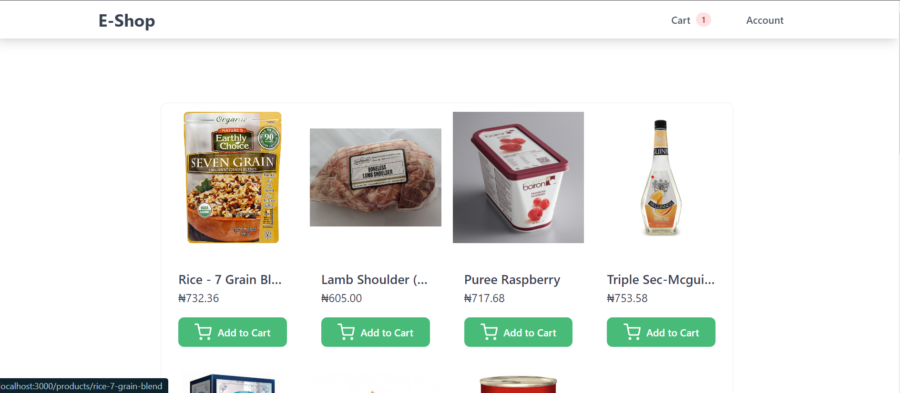

# E-SHOP STORE

A full-stack e-commerce project built with Postgres, Express, React and Node.


## Screenshots



## Run Locally

Clone the project

```bash
  git clone https://github.com/satpal82bhandari/e-shop.git
```

Go to the project directory

```bash
  cd e-shop
```

Install dependencies

```bash
  npm install
```

Go to server directory and install dependencies

```bash
  npm install
```

Go to client directory and install dependencies

```bash
  npm install
```


Start both client and server concurrently from the root directory

```bash
  npm run dev
```


## Tech

- [React](https://reactjs.org/)
- [Node](https://nodejs.org/en/)
- [Express](http://expressjs.com/)
- [Postgres](https://www.postgresql.org/)

- [Tailwind-CSS](https://tailwindcss.com/)

## Environment Variables

To run this project, you will need to add the following environment variables to your .env files in both client and server directory

#### client/.env

`VITE_API_URL`

### server/.env

`POSTGRES_USER`

`POSTGRES_HOST`

`POSTGRES_PASSWORD`

`POSTGRES_DATABASE`

`POSTGRES_DATABASE_TEST`

`POSTGRES_PORT`

`PORT`

`SECRET`

`REFRESH_SECRET`


